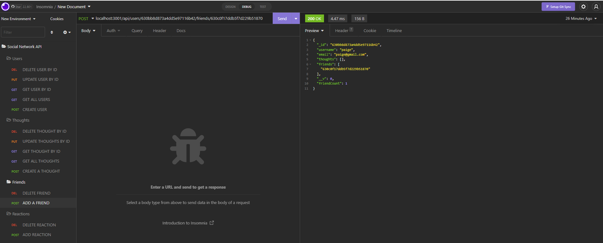
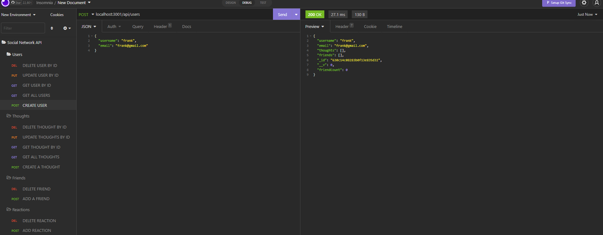

# social-network-API

## Table-of-Contents

  * [Demonstration](#demostration)
  * [Purpose](#installation)
  * [Built-With](#built-with)
  * [Installation](#installation)
  * [Usage](#usage)
  * [Photos](#photos)
  * [GitHub-Page-Link](#github-page-link)
  * [Contribution](#contribution)
  

## Demonstration
Walkthrough video demonstration provided right [here](https://drive.google.com/file/d/1LIRCy0o8p30dnNpFCKmC5Fz4h2xEuloe/view)

## Purpose
This application is to provide the back-end functionality for a social network where users can create profiles, post their own thoughts, add many friends, and react to other user's thoughts as well. The api was created to handle all of the requests for adding friends, deleting users, deleting thoughts and reactions.

## Built With
* Mongoose
* Express.js
* MongoDB
* Javascript

## Installation
 Clone this repository and run the following commands in the command line.

* `npm init -y`
* `npm i express mongoose`

## Usage
To get this program to run, use `npm start` in the command line.

## Photos
  
  

## GitHub Page Link
[https://github.com/pcaiozzo/social-network-API](https://github.com/pcaiozzo/social-network-API)

## Contribution
Paige Caiozzo [https://github.com/pcaiozzo](https://github.com/pcaiozzo)